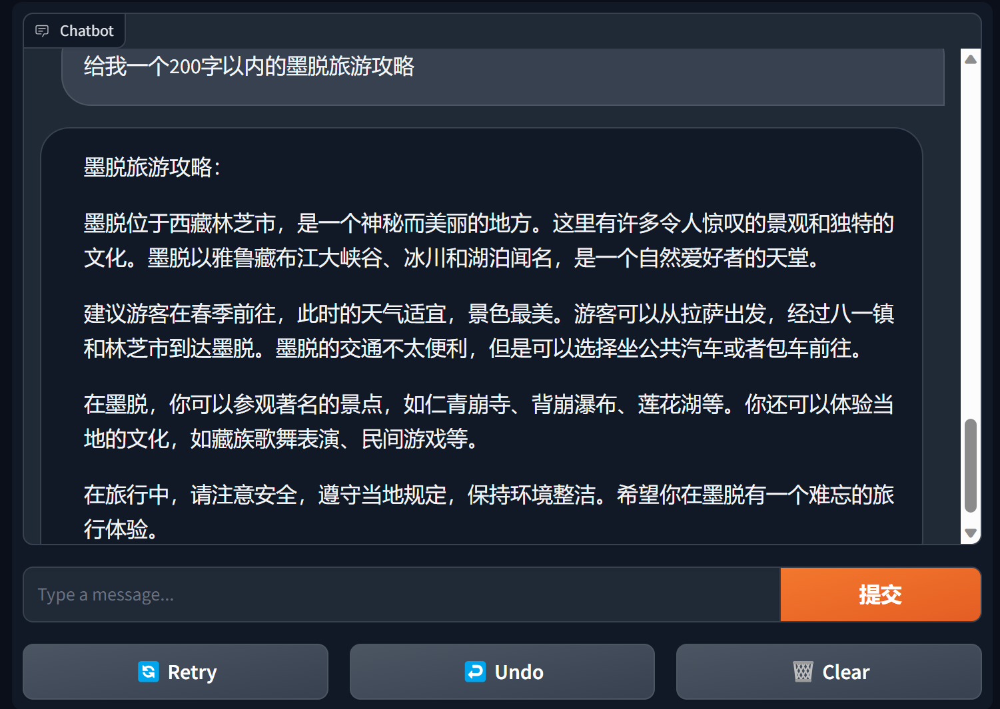
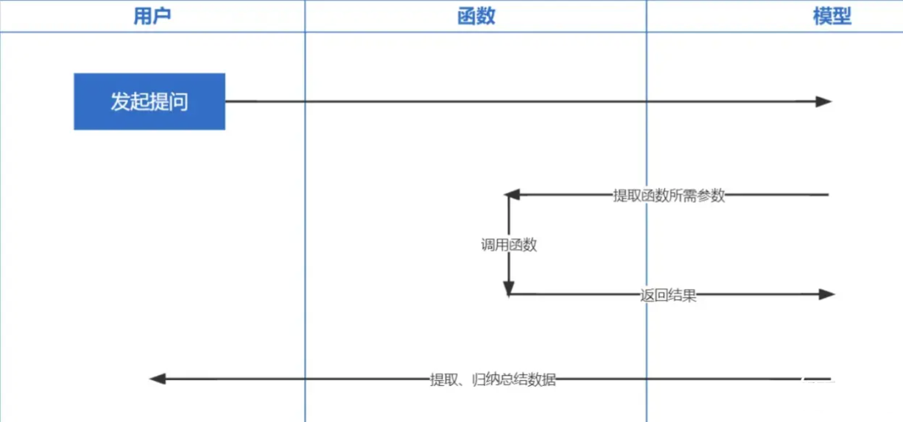

# bida：简单、易用、稳定、高效，便于扩展和集成的，大语言模型工程化开发框架

## 快速上手

1. 从pip或pip3安装最新的bida
```cmd
pip install -U bida
```

2. 新建py文件或Jupyter Notebook：

```python
from bida import ChatLLM

llm = ChatLLM(
    model_type='openai',                                # 调用openai的chat模型
    model_name='gpt-4')                                 # 设定模型为：gpt-4，默认是gpt3.5

result = llm.chat("从1加到100等于多少？只计算奇数相加呢？") 
print(result)
```
```python
from bida import ChatLLM

llm = ChatLLM(
    model_type="baidu",                                 # 调用百度文心一言
    stream_callback=ChatLLM.stream_callback_func)       # 使用默认的流式输出函数

llm.chat("你好呀，请问你是谁？") 
```


## 已支持模型 ( 持续更新中... 截止2023年10月，[国内开放商用API的模型已经全部支持](https://mp.weixin.qq.com/s/Hjg1lYXGdzOP-jUbXuJyXA))

| 模型公司         | 模型类型  | 模型名称         |  是否支持   | 说明                      |
|:---------------:|:---------:|:---------------:| :--------: |:--------------------------|
| OpenAI | [Chat](https://platform.openai.com/docs/api-reference/chat)   | gpt-3.5，gpt-4   |  √ | 支持gpt3.5和gpt4全部模型  |
| | [Text Completion](https://platform.openai.com/docs/api-reference/completions) | text-davinci-003 |  √ | Text 生成类模型   |
| | [Embeddings](https://platform.openai.com/docs/api-reference/embeddings)   | text-embedding-ada-002 | √ | 向量化模型 |
| |
| 百度-文心一言 | Chat | [ernie-bot](https://cloud.baidu.com/doc/WENXINWORKSHOP/s/jlil56u11), [ernie-bot-turbo](https://cloud.baidu.com/doc/WENXINWORKSHOP/s/4lilb2lpf) | √ | 百度商用Chat模型  |
| | Embeddings  | [embedding_v1](https://cloud.baidu.com/doc/WENXINWORKSHOP/s/alj562vvu)  |  √ | 百度商用向量化模型 |
| | 托管模型 | [各类开源模型](https://cloud.baidu.com/doc/WENXINWORKSHOP/s/Nlks5zkzu) | √ | 百度托管的各类开源模型，请使用百度第三方模型接入协议自行配置，详见下文的模型接入章节 |
| |
| 阿里云-通义千问  | Chat | [qwen-v1, qwen-plus-v1](https://help.aliyun.com/zh/dashscope/developer-reference/api-details?spm=a2c4g.11186623.0.0.6160416fZvec2K), [qwen-7b-chat-v1](https://help.aliyun.com/zh/dashscope/developer-reference/api-details-12?spm=a2c4g.11186623.0.0.5f1d7abe3hDzoF) |  √  | 阿里云商用和开源Chat模型 |
| | Embeddings  | [text-embedding-v1](https://help.aliyun.com/zh/dashscope/developer-reference/generic-text-vector/?spm=a2c4g.11186623.0.0.4c7a7ba0PtIctI)  | √ | 阿里云商用向量化模型  |
| | 托管模型 | [各类开源模型](https://dashscope.console.aliyun.com/model?spm=5176.28072958.J_2026023950.2.49c8764fIXrFly) | √ | 阿里云托管的其他各类开源模型，请使用阿里云第三方模型接入协议自行配置，详见下文的模型接入章节 |
| |
| MiniMax  | [Chat](https://api.minimax.chat/document/guides/chat?id=6433f37294878d408fc82953) | abab5, abab5.5 |  √  | MiniMax商用Chat模型 |
| | [Chat Pro](https://api.minimax.chat/document/guides/chat-pro?id=64b79fa3e74cddc5215939f4) | abab5.5 | √ | MiniMax商用Chat模型, 采用[自定义Chatcompletion pro模式](https://api.minimax.chat/document/tuning-guide?id=64841821346c0de66a730bd5)，[支持多人多bot对话场景，示例对话，返回格式限制，函数调用，插件等功能](examples/MINIMAX模型调用说明.ipynb) |
| | [Embeddings](https://api.minimax.chat/document/guides/embeddings?id=6464722084cdc277dfaa966a) | embo-01 | √ | MiniMax商用向量模型 |
| |
| 智谱AI-ChatGLM | Chat | [ChatGLM-Pro、Std、Lite](https://open.bigmodel.cn/dev/api#overview), [characterglm](https://open.bigmodel.cn/dev/api#super-humanoid) | √ | 智谱AI多版本商用大模型 |
| | Embeddings | [Text-Embedding](https://open.bigmodel.cn/dev/api#vector) | √ | 智谱AI商用文本向量模型 |
| |
| 讯飞-星火 | Chat | [SparkDesk V1.5, V2.0](https://www.xfyun.cn/doc/spark/Web.html) | √ | 讯飞星火认知大模型 |
| | Embeddings | [embedding](https://www.xfyun.cn/doc/spark/embedding_api.html) | √ | 讯飞星火文本向量模型 |
| |
| 商汤-日日新 | Chat | [nova-ptc-xl-v1, nova-ptc-xs-v1](https://platform.sensenova.cn/#/doc?path=/chat/GetStarted/APIList.md) | √ | SenseNova 商汤日日新大模型 |
| |
| 百川智能 | Chat | [baichuan-53b-v1.0.0](https://platform.baichuan-ai.com/docs/api) | √ | 百川53B大模型 |
| |
| 腾讯-混元 | Chat | [Tencent Hunyuan](https://cloud.tencent.com/document/product/1729/97732) | √ | 腾讯混元大模型 |
| |
| 自行部署的开源模型 | Chat, Completion, Embeddings | 各类开源模型 | √ | 使用[FastChat](https://github.com/lm-sys/FastChat)等部署的开源模型，提供的Web API接口遵循[OpenAI-Compatible RESTful APIs](https://github.com/lm-sys/FastChat/blob/main/docs/openai_api.md)，可以直接支持，详见下文的模型接入章节 |
| |

**注意**：

1. 以上模型和API能否使用，依赖自行购买开通的模型范围，相关Key需配置完成后才可以（详见下面环境变量章节），购买及开通请联系厂商咨询。
2. 如果需要增加模型或增加新的模型公司进来，请参考下面的模型接入章节。
3. 如果希望适配你们的模型或提出改进意见，请联系**pfzhou@gmail.com**


## 缘起与定位

### - 开发人员切换到面向AIGC开发非常困难

AIGC里面的模型LLM和提示词Prompt两项技术都非常新，发展日新月异，理论、教程、工具、工程化等各个方面都非常欠缺，使用的技术栈与当前主流开发人员的经验几乎没有重叠：

| 分类     | 当前主流开发                    | Prompt工程                                    | 开发模型、微调模型                         |
|:------:|:------------------------- |:------------------------------------------- | --------------------------------- |
| 开发语言   | Java、.Net、Javscript、ABAP等 | 自然语言，Python                                 | Python                            |
| 开发工具   | 非常多和成熟                    | 无                                           | 成熟                                |
| 开发门槛   | 较低且成熟                     | 低但非常不成熟                                     | 非常高                               |
| 开发技术   | 清晰且稳态                     | 入门简单但非常难于稳态输出                               | 复杂且多变                             |
| 常用技术   | 面向对象、数据库、大数据              | prompt tunning、incontext learning、embedding | Transformer、RLHF、Finetunning、LoRA |
| 开源支持   | 丰富且成熟                     | 非常混乱处于较低水平                                  | 丰富但不成熟                            |
| 开发成本   | 低                         | 较高                                          | 非常高                               |
| 开发人员   | 丰富                        | 极度稀缺                                        | 非常稀缺                              |
| 开发协同模式 | 根据产品经理交付的文档进行开发           | 一人或极简的小组，从需求到交付运营全部工作                       | 根据理论研究方向开发                        |

### - 企业需求非常旺盛，处于快速上升趋势

当前，所有的科技公司、互联网公司、大数据公司几乎都在all in这个方向，但更多的传统企业还处于迷茫的状态。传统企业并非不需要，而是： 1) 没有技术人才储备，不知道做什么；2) 没有硬件储备，没有能力做；3) 业务数字化程度底，用AIGC改造升级周期长、见效慢。

### - 每个模型都提供了API，有的还有完善的SDK，为什么要再封装一遍？

目前国内外各种商用、开源模型太多，发展又特别快，不过模型的API、数据对象并不一样，导致我们面对一个新模型（甚至一个新版本），都要去阅读开发文档，并修改自己的应用代码去适配，相信每个应用开发人员都测试过很多个模型，应该都深受其苦。

实际上，模型能力虽有不同，但提供能力的模式大体是一致的，因此有一个可以适配大量模型API，提供统一调用模式的框架，就变成了很多开发人员的迫切需求。

### - 既然如此，这些langchain都有，直接用不好吗，为什么要重复造轮子？

首先，bida并非要替代langchain，而是针对的目标定位不同、开发理念也有很大差异：

| 分类                    | langchain                                              | bida                                                                          |
|:---------------------:|:------------------------------------------------------ |:----------------------------------------------------------------------------- |
| 目标人群                  | AIGC方向的全量开发人群                                          | 对把AIGC与应用开发结合有迫切需求的开发人员                                                       |
| 模型支持                  | 支持本地部署或远端部署的各种模型                                       | 仅支持提供Web API的模型调用，目前商用模型大部分都提供，开源模型使用FastChat等框架部署后也可以提供Web API               |
| 框架结构                  | 因为提供的能力多，结构非常复杂，截止2023年8月，核心代码已有1700多个文件，15万行代码，学习门槛较高 | 核心代码十余个，2000行左右代码，学习和修改代码较简单                                                  |
| 功能支持                  | 提供AIGC方向各类模型、技术、应用领域的全覆盖                               | 当前提供ChatCompletions、Completions、Embeddings、Function Call等功能支持，语音、图像等多模态功能近期陆续发布 |
| Prompt                | 提供Prompt模板，但自有功能使用的Prompt内嵌在代码内，调试和修改都很困难              | 提供Prompt模板，当前无内置功能使用Prompt，将来如果使用，也会采用配置型后加载模式，便于用户自行调整                       |
| Conversation & Memory | 支持，并提供多种Memory管理方式                                     | 支持，支持Conversation持久化（保存至duckdb中），Memory提供限定归档会话能力，其他能力有扩展框架可自行扩展              |
| Function & Plugin     | 支持，并提供很丰富的扩展能力，但使用效果依赖大模型的自身能力                       | 兼容使用OpenAI的Function Call规范的大模型                                                |
| Agent & Chain         | 支持，并提供很丰富的扩展能力，但使用效果依赖大模型的自身能力                       | 不支持，计划另开项目实现，也可基于当前框架自行扩展开发                                   |
| 其他功能                  | 支持很多其他功能，比如文档拆块（拆块后做embedding，用于实现chatpdf等类似的功能）       | 暂无其他功能，如果增加也会采用另开兼容项目的方式来实现，当前可以使用其他产品提供的能力组合后实现  |
| 运行效率 | 很多开发者反映比直接调用API慢，原因未知 | 仅封装了调用流程和统一了调用接口，性能与直接调用API没有区别 |

langchain做为业内领军的开源项目，为大模型以及AGI的推广做出了巨大贡献，我们也在项目中应用了它，同时在开发bida时，也借鉴了很多它的模式和思想。但langchain太想做一个大而全的工具，不可避免的也产生了很多缺点，下面几篇文章，意见都差不多：[Max Woolf](https://minimaxir.com/2023/07/langchain-problem/) - [中文](https://mp.weixin.qq.com/s/Iwe6M391b2BBWae-HmOIJQ), [Hacker News](https://news.ycombinator.com/item?id=36645575) - [中文](https://mp.weixin.qq.com/s/GKF28C1yzWZDtCXjJQ52hg) 。

圈内流行一句话非常好的做了总结：**langchain，一个人人都会学习，但最终都会丢弃的教科书。**

### - 因此， 基于以上几点，我们希望根据当前主流开发人员和企业应用开发的特点，搭建一个简单、易用、稳定、高效，便于扩展和集成的大语言模型工程化开发框架，大幅消减开发AI产品的难度和周期。


## 使用说明

### 1. 初始化环境

#### 1.1 安装bida
从pip或pip3安装最新的bida
```cmd
pip install -U bida
```

从github clone项目代码到本地目录：
```cmd
git clone https://github.com/pfzhou/bida.git
pip install -r requirements.txt
```
#### 1.2 配置环境变量

修改当前代码根目录下面的文件： **[".env.template"](.env.template)** 的扩展名，成为 **".env"** 环境变量文件。请根据文件中的说明，把**已经申请模型的key**配置进去。

**请注意**：该文件已经加入忽略清单，不会被传到git服务器。

#### 1.3 验证是否配置成功

[examples\1.初始化环境.ipynb](examples/1.初始化环境.ipynb)


### 2. 使用bida调用模型

下面演示代码会混合使用各种bida支持的模型，请根据自己购买的模型修改替换代码中的**[model_type]**值为对应的模型公司名字，就可以快速切换各种模型进行体验：
```python
# 更多信息参看\bida\models\*.json中的model_type配置
# openai
llm = ChatLLM(model_type="openai")
# baidu
llm = ChatLLM(model_type="baidu")
# baidu third models（llama-2...）
llm = ChatLLM(model_type="baidu-third")
# aliyun
llm = ChatLLM(model_type="aliyun")
# minimax
llm = ChatLLM(model_type="minimax")
# minimax ccp
llm = ChatLLM(model_type="minimax-ccp")
# zhipu ai
llm = ChatLLM(model_type="chatglm2")
# xunfei xinghuo
llm = ChatLLM(model_type="xfyun")
# senstime
llm = ChatLLM(model_type="senstime")
# baichuan ai
llm = ChatLLM(model_type="baichuan")
# tencent ai
llm = ChatLLM(model_type="tencent")
```

#### 2.1 Chat模式

> Chat模式：ChatCompletion，当前主流的LLM交互模式，bida支持会话管理，支持持久化保存和Memory管理。

- 调用并打印回答内容：

```python
from bida import ChatLLM

llm = ChatLLM(model_type='baidu')
result = llm.chat("你好呀，请问你是谁？") 
print(result)
```

- 流式stream调用，实现打字机效果：

```python
from bida import ChatLLM

# stream调用
llm = ChatLLM(model_type="baidu", stream_callback=ChatLLM.stream_callback_func)

result = llm.chat("你好呀，请问你是谁？")      
```

- 多轮对话：

```python
from bida import ChatLLM

llm = ChatLLM(model_type="baidu", stream_callback=ChatLLM.stream_callback_func) 

result = llm.chat("你是一个服务助理，请简洁回答我的问题。我的名字是老周。")
result = llm.chat("我的名字是？")
```

以上的详细代码和更多功能示例，请参考下面的NoteBook：

> [examples\2.1.Chat模式.ipynb](examples/2.1.Chat模式.ipynb)


- **使用gradio建立chatbot**

    - [gradio](https://www.gradio.app/)是一款非常流行的自然语言处理界面框架

    - bida + gradio 可以用几行代码就搭建一个可用的应用程序
  
```python
import gradio as gr
from bida import ChatLLM

llm = ChatLLM(model_type='openai')

def predict(message, history):
    answer = llm.chat(message)
    return answer

gr.ChatInterface(predict).launch()
```



> 详细内容见：[bida+gradio的chatbot demo](examples/gradio-chatbot-demo.ipynb)


#### 2.2 Completion模式

> Completion模式：Completions或TextCompletions，上一代LLM交互模式，仅支持单轮会话，不保存聊天记录，每次调用都是全新的交流。

**请注意：** 该模式在[OpenAI 2023年7月6日的文章中](https://openai.com/blog/gpt-4-api-general-availability)，明确表示要逐步淘汰，新出的模型也基本不提供相关功能，即使支持的模型估计也会采取跟随OpenAI，预计未来都会逐渐淘汰。

```python
from bida import TextLLM

llm = TextLLM(model_type="openai")
result = llm.completion("你是一个服务助理，请简洁回答我的问题。我的名字是老周。")
print(result)
```

示例代码详见：

> [examples\2.2.Completion模式.ipynb](examples/2.2.Completion模式.ipynb)

#### 2.3 使用提示词

提示词Prompt是大语言模型中最重要的功能，颠覆了传统面向对象的开发模式，转变为： **Prompt工程**。 本框架使用“提示词模板Prompt Templete”来实现，支持替换标记、多模型设定不同的提示词和模型执行交互时自动替换等功能。

当前已提供 **PromptTemplate_Text** ：支持使用字符串文本生成Prompt模板，bida也支持灵活的自定义模板，未来计划提供从json和数据库中加载模板的能力。

详细示例代码请参看下面的文件：
> [examples\2.3.Prompt提示词.ipynb](examples/2.3.Prompt提示词.ipynb)

**提示词中重要说明**
- 不同模型对提示词的支持能力不尽相同，比如：
1. ChatGPT和Vicuna等国外大模型，对中文提示词支持不够稳定，建议用英文写提示词
2. 国内很多模型对推理类的提示词不敏感（指令遵循不好），对于生成Json、SQL、Code的指令几乎完全忽略
3. 英文大写单词和中文加入【】、“”等强调信息，对模型注意力有明显影响
4. 重要信息可以重复多遍，对模型注意力有明显影响，放置的位置因模型而异，有的在开始效果好，有的在结尾效果好
5. 提示词太长影响输出的token数量，要根据不同模型的max_token值做调整
   
总的来说，建议提示词遵循：**设定角色，明确任务，给出上下文（相关资料或示例）的三段式结构**，可以参考示例中的写法。

- 提示词的一些介绍文档，供参考：

1. [吴恩达的系列课程 https://learn.deeplearning.ai/login](https://learn.deeplearning.ai/login) ， [中文版](https://github.com/datawhalechina/prompt-engineering-for-developers) ， [解读](https://mp.weixin.qq.com/s/gUtB71uWI7Dg_tfRzaidCA)

 2. [openai cookbook https://github.com/openai/openai-cookbook](https://github.com/openai/openai-cookbook)

3. 微软Azure文档：[提示工程简介](https://learn.microsoft.com/zh-cn/azure/cognitive-services/openai/concepts/prompt-engineering) , [提示工程技术](https://learn.microsoft.com/zh-cn/azure/cognitive-services/openai/concepts/advanced-prompt-engineering?pivots=programming-language-completions)

4. [Github上最火的Prompt Engineering Guide](https://github.com/dair-ai/Prompt-Engineering-Guide) ， [中文版](https://github.com/wangxuqi/Prompt-Engineering-Guide-Chinese)


#### 2.4 函数调用function calling

[**函数调用Function Calling**](https://openai.com/blog/function-calling-and-other-api-updates)是OpenAI2023年6月13日发布的功能，我们都知道ChatGPT训练的数据是基于2021年之前的，你要问一些实时性相关的问题就没法回答你了，而函数调用让实时获取网络数据成为可能，比如查询天气预报、查股票、推荐个近期的电影之类的。

- 函数调用的流程是什么？
1. 用户发起提问时，调用一次带有函数描述的completions接口，gpt会判断是否支持调用函数，如果可以就从用户的提问信息中提取出函数所需要的参数。
2. 开发者拿到gpt提取出来的参数后自行调用函数并返回结果
3. 将函数的返回结果再次发给GPT做总结归纳为自然语言
   
- 哪些模型支持：gpt-3.5-turbo-0613 和 gpt-4-0613 这两个模型都支持函数调用，MiniMax的Pro模式也支持，其他厂商也在跟进中。
- 需要注意：
1. 整个过程会对gpt执行两次调用，第一次调用从问题中提取函数参数，第二次对函数返回结果做归纳总结
2. 函数调用并不是由gpt调用，而是开发者来调用，本框架已经封装了自动调用方法，但需要开发者自己实现具体的执行代码

- OpenAI 相关资料：[Guide](https://platform.openai.com/docs/guides/gpt/function-calling),  [API Reference](https://platform.openai.com/docs/api-reference/chat/create#chat/create-functions), [CookBook1](https://github.com/openai/openai-cookbook/blob/main/examples/How_to_call_functions_with_chat_models.ipynb), [CookBook2](https://github.com/openai/openai-cookbook/blob/3115683f14b3ed9570df01d721a2b01be6b0b066/examples/How_to_call_functions_for_knowledge_retrieval.ipynb)
- 详细示例参看：[examples/2.4.function_calling函数调用.ipynb](examples/2.4.function_calling函数调用.ipynb)


#### 2.5 添加自定义函数
1. /bida/functions/目录下建立一个函数定义json文件
2. 编写具体执行函数代码的py文件
3. 启动框架调试

- 详细内容见：[function接入手册](bida/functions/README.md)


#### 2.6 Embeddings嵌入模型

Embeddings技术是实现Prompt inContext Learning最重要的技术，对比以前关键词检索，又提升了一步。

**注意**：不同模型embedding出来的数据是不通用的，因此检索时问题的embedding也要用同一个模型才可以。

| 模型名称 | 输出维度 | 批处理记录数 | 单条文本token限制 |
| :---:  | :---: | :---: | :---: |
| OpenAI | 1536 | 不限 | 8191 |
| 百度 | 384 | 16 | 384 |
| 阿里 | 1536 | 10 | 2048 |
| MiniMax | 1536 | 不限 | 4096 |
| 智谱AI | 1024 | 单条 | 512 |
| 讯飞星火 | 1024 | 单条 | 256 |

**注意：** bida的embedding接口支持批处理，超过模型批处理限制会自动分批循环处理后一起返回。单条文本内容超过限制token数，根据模型的逻辑，有的会报错，有的会截断处理。

> 详细示例参看：[examples\2.6.Embeddings嵌入模型.ipynb](examples/2.6.Embeddings嵌入模型.ipynb)


## 模型接入说明

1. bida\models\目录下建立一个模型配置json文件
2. 编写具体模型实现方法的py文件
3. 启动框架调试
   详细内容见：[模型接入手册](bida/models/README.md)


## bida框架结构

```
├─bida                          # bida框架主目录
│  ├─core                           # bida框架核心代码
│  ├─functions                      # 自定义function文件
│  ├─   *.json                          # function定义
│  ├─   *.py                            # 对应的调用代码
│  ├─models                         # 接入模型文件
│  ├─   *.json                          # 模型配置定义：openai.json、baidu.json等
│  ├─   *_api.py                        # 模型接入代码：openai_api.py、baidu_api.py等
│  ├─   *_sdk.py                        # 模型sdk代码：baidu_sdk.py等
│  ├─prompts                        # 自定义prompt模板文件
│  ├─*.py                           # 框架其他代码文件
├─docs                          # 帮助文档
├─examples                      # 演示代码、notebook文件和相关数据文件
├─test                          # pytest测试代码
│ .env.template                 # .env的模板
│ LICENSE                       # MIT 授权文件
│ pytest.ini                    # pytest配置文件
│ README.md                     # 本说明文件
│ requirements.txt              # 相关依赖包
```
## 联系方式
#### pfzhou@gmail.com
我们希望可以适配更多的模型，也欢迎您提出宝贵意见，一起为开发者提供更好的产品！